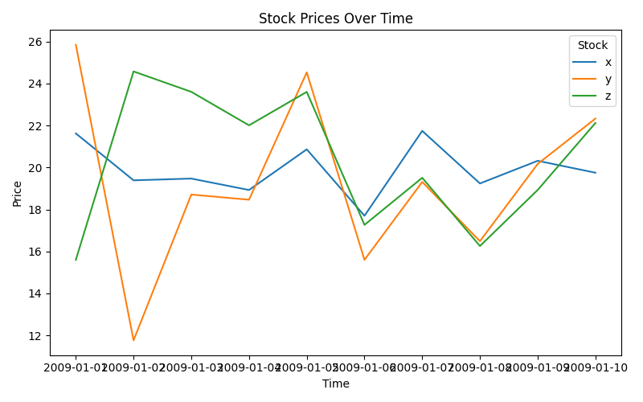

# Midterm Project: Simulated Stock Prices Using Python
**Date:** October 10

## 1. Overview
This project simulates and visualizes three artificial stock prices over a 10-day period using Python. The purpose is to demonstrate data manipulation, visualization, and analysis techniques comparable to what we previously learned using R. NumPy was used for random number generation and vectorization, pandas for data reshaping and summarization, and Matplotlib for visualization.

## 2. Code Example and Output
From our class, we learned how to create random datasets and reshape them using `pivot_longer()` and `pivot_wider()` in R. In Python, these operations are achieved using `pd.melt()` and `DataFrame.pivot()`.

Below is a summary of the minimum and maximum prices per stock:

| stock   |     min |     max |
|:--------|--------:|--------:|
| x       | 17.6985 | 21.7448 |
| y       | 11.7594 | 25.8484 |
| z       | 15.5975 | 24.5789 |

## 3. Additional Application
The same data structure could be extended to model real-world stock behavior by replacing random data with API data (for instance, using Yahoo Finance or Alpha Vantage). This would allow users to track actual historical performance, compute moving averages, and compare volatility between stocks — a common application in quantitative finance.

## 4. Visualization
The following Matplotlib plot illustrates how each stock’s price fluctuates over time:

Each color corresponds to a different stock. We can see that while all begin around 20, the “y” and “z” series show much more variation, reflecting their higher standard deviations (4 vs. 1 for x).

## 5. Data Summary Using Pandas
Using pandas, the data was easily reshaped from wide to long format and summarized using the `groupby()` and `agg()` methods. Finally, the `.to_markdown()` function was used to print a clean Markdown table for documentation purposes.

## 6. Conclusion
This project demonstrates the full workflow of data creation, transformation, visualization, and summarization in Python — equivalent to what we achieved using R with `ggplot2` and `tidyverse`. By combining `NumPy`, `pandas`, and `Matplotlib`, Python offers a powerful ecosystem for scientific computing and reproducible analysis.

The skills applied here—vectorized computation, data wrangling, and visualization—form the foundation of modern data science workflows.
